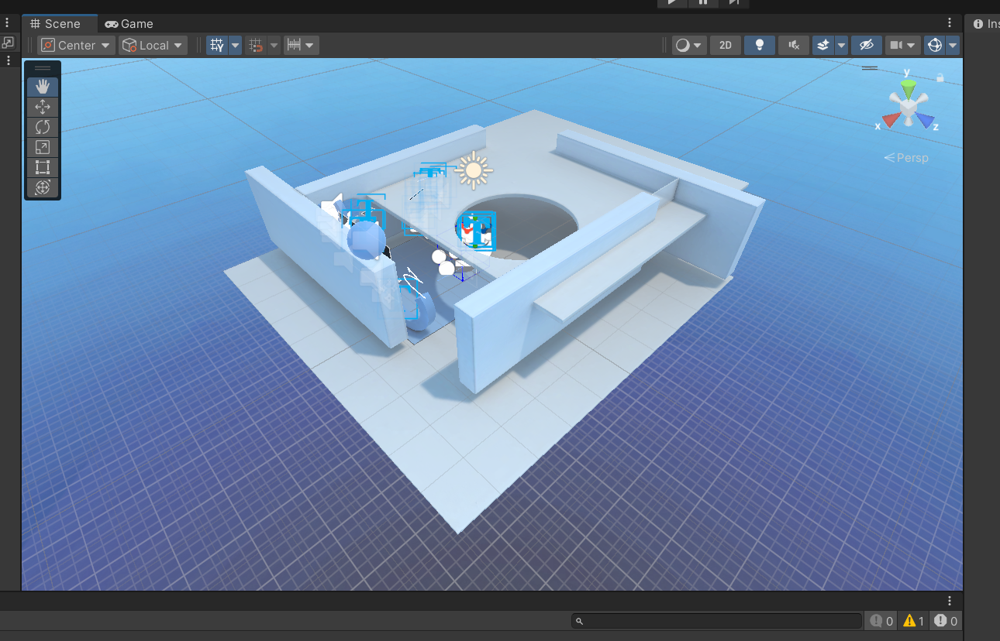
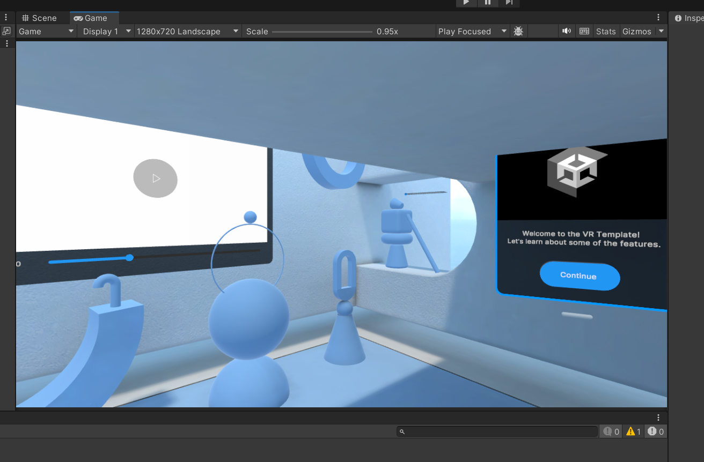

### Group 4: Reid Abbie, Crane Alan, Wood Alexander, Blackburn Ben

:::::::::::::::::::::::::::::::::::::: questions 

- What is a camera in a 3D scene?
- What are the types of cameras?

::::::::::::::::::::::::::::::::::::::::::::::::

::::::::::::::::::::::::::::::::::::: objectives

- Explain how cameras work on 3D scenes
- Explain what types of cameras there are in Game Engine and their typical parameters
- Show how to create cameras for VR and non-VR environments

::::::::::::::::::::::::::::::::::::::::::::::::

## Introduction

A camera is essential to any game/3D scene, as they define what the user can see. There are lots of different types of cameras and there is no one type of that is best. Different scenarios need different cameras to give the best user experience.

## What is a camera in a 3D scene?

A camera in a 3D space is a perspective. It is a virtual viewpoint from which the scene is rendered.
This perspective defines what is visible and how it is seen.    

The perspective is defined by the camera's:   
- Position  , Where the camera is situated within the 3d scene   
- Orientation  , The direction the camera is facing   
- Field of View  ,  How wide the camera's view is, how much of the scene is visible from this perspective

  

  

## Explain what types of cameras there are in Game Engine and their typical parameters

## First Person
A first-person camera gives the view from a character's point of view and replicates human vision. This camera type is often used for FPS and action games. 

Parameters of first-person camera:      
- field of view (FOV) = How large the camera's peripheral vision is.    
- Camera sway and head bobbing =  to simulate head movements when walking.   
- Camera Shake = used to show vibrations from nearby events such as explosions.    
- Motion blur - used to simulate blur experienced by the eyes during fast movement   

## Third Person
A third-person view is taken from behind and slightly above the player's character. This camera type is often used within action and role-playing games.

Parameters of a third-person camera   
- distance of the following camera from the character    
- the angle of the camera position   
- collision detection to ensure the camera navigates within the environment correctly    

## Top Down
A top-down view gives an aerial view of the character's position.    
- camera rotation     
- the angle of the camera position     
- camera movement = move with character or static     

## Side Scrolling Camera 
provides the user with a side-on angle of a 2d plane; this camera type is used in platformer games, such as Mario.     

- Camera following direction = Does the camera scroll vertically or horizontally     
- Camera Movement = move with characters' position or static      
- Camera bounds = where the camera can/cannot move      

## How to create cameras for VR and non-VR environments

A camera is created differently in each engine, but all are as simple as drag and dropping them into the environment

### Unity

- Right left click on the hierarchy of the environment
- In the drop-down menu click camera which will create a new camera in the environment.

### Unreal Engine

- Click on window
- Followed by place anchors
- All classes 
- Then to place a camera you drag the camera anchor into the environment where you want it

## Code Examples

https://youtu.be/DXri5QRC3HU?feature=shared

https://youtu.be/xvyrzwwU1DE?feature=shared

https://youtu.be/OIxjcScxwaw?feature=shared

## Unity Learn

https://learn.unity.com/tutorial/working-with-unity-cameras-questions#
