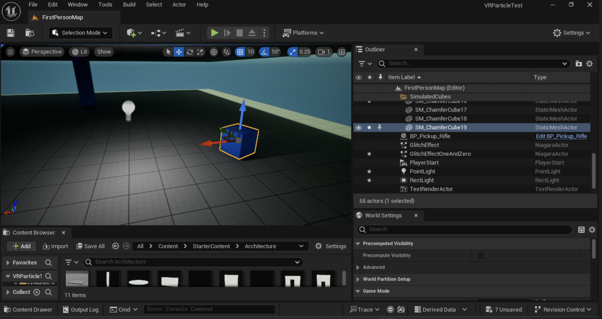
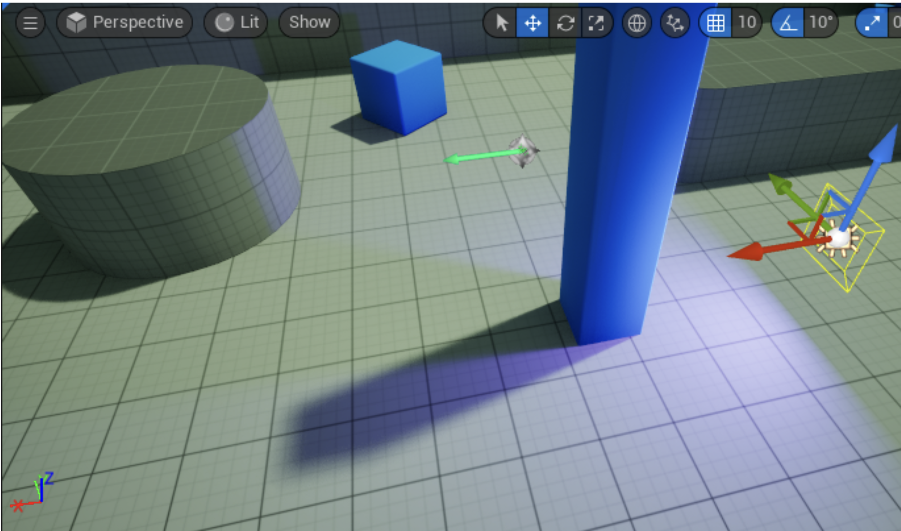

### Group 5: Cerrudo Carlos, Duke Harry, Parker Luk, Taylor Tom
:::::::::::::::::::::::::::::::::::::: questions 

- What are the basic types and parameters of lighting in a VR environment?
- How can good quality lighting effects (e.g. shadows) be achieved?
Shadows in our engine are quite easy to achieve, simply requiring us to tick to have shadows remain on. 
- How do(es) lighting affect performance of the environment?

::::::::::::::::::::::::::::::::::::::::::::::::

::::::::::::::::::::::::::::::::::::: objectives
- Explain the basics of lighting in VR environments
- Demonstrate the implementation of basic lighting
- Explore how to create good lighting including shadows

::::::::::::::::::::::::::::::::::::::::::::::::

## Basics of lighting in VR environments

In unreal engine, lighting is determined via lights, with a few different forms.

Firstly *Directional Lights*, which provide an even lighting to every object in the world, so that things do not become impossible to see, acting like sun or moon light.

Secondly, *Point Lights*. These lights shed light and create shadows, only within the radius of the light, similar to a light bulb.

Thirdly, *Spot Lights*. These shed light in a beam in the direction they are pointed, similar to a torch, or a … spotlight.

Fourthly, there are *Rect Lights*. These lights are similar to spotlights in that they are directional, but rather than being a narrow circular beam, sheds light evenly in one full direction, and sheds no light in the other.

Lastly there is the *Sky Light*. This captures distant parts of the scene as a light, allowing for reflections from far away objects.

You also need to consider the method and rendering of light sources. Baked, Dynamic or Hybrid methods have pro’s and con’s to each. For VR games, processing and load is a big concern to ensure the hardware of devices can run the application. Generally speaking, Baked is fast and stable, whereas Dynamic is a heavier load when rendering. Baked lighting may produce more flat and static results whereas Dynamic is more realistic, you may also consider a Hybrid between the two.

## Demonstrate the implementation of basic lighting

Lighting in our engine is split into 3 categories. 

*Static* lighting, which is built into the level, **staining** the nearby objects with the lights and shadows, stationary, which is similar to static but can have the colour of the light and its intensity changed in game, affecting the precalculated areas accordingly, and *Moveable* light, which affects performance the most, as it is calculated constantly.

{alt="lux"}

{alt="lux"}

Its as simple as dragging the lights into the scene!

### How to create good lighting including shadows

As mentioned before, shadows are mostly done automatically.

{alt="lux"}

If we place multiple lights, and allow multiple colours and shadows, we can even make effects like this!

With the update to Unreal Engine 5, the lighting feature set has also been changed including: Lumen: A new global illumination system; Nanite Mesh: A new static mesh that works in tandem with Lumen; Emissive Textures: That gives a glow to textures when light-sources hit them. See an example of the update with the below comparison:

https://www.youtube.com/watch?v=NHGIE2jM7yU&ab_channel=ErosDadoli
